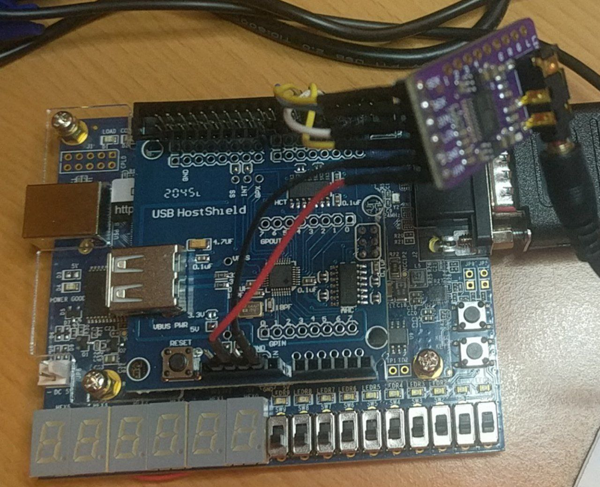

# Xevious 

DE10-lite port for USB Host shield (not needed to modify it) + DAC I2S by @somhi (15/11/22) adapted from DE10_lite port by DarFPGA (https://sourceforge.net/projects/darfpga/files/Software%20VHDL/xevious/)

See original [README.txt](README.txt)
------------------------

